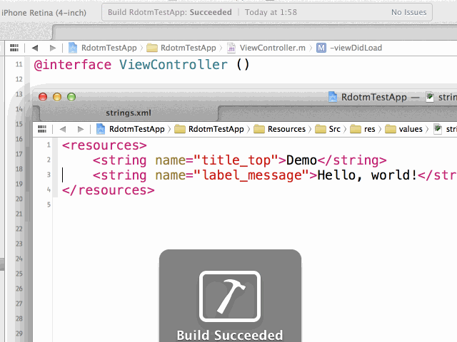

# rdotm

[](https://travis-ci.org/ksoichiro/rdotm)
[](https://coveralls.io/r/ksoichiro/rdotm?branch=master)

rdotm(R.m) is the Objective-C resource definition generator like Android app's `R.java`.

[](testdata/images/demo.gif)

## Features

### Color reference method generation

#### What is it?

A tool to generate code that makes you possible to access color resources via method:  
`<color name="title">#FF0099CC</string>` -> `[R color_title]`

Hex color expressions are converted when executing this tool.  
(Generated colors are written using `[UIColor colorWithRed:green:blue:alpha]`.)

So if you have a utility method like `[UIColor colorWithHexString]` to convert hex strings on runtime, your app could be a little bit faster.

### String reference method generation

#### What is it?

A tool to generate code that makes you possible to access string resources via method:  
`<string name="something">anything</string>` -> `[R string_something]`

#### Why should I use Android XML format?

Because you can share resource files with Android app project.

#### Why not NSLocalizedString?

You can use `Localizable.strings` and `NSLocalizedString`, but it has a problem that even if you have some typos you will not be noticed while compiling them.

For example, if you define a string like this:

```c
"something" = "anything";
```

then you can refer this string with the following code:

```objc
// OK, this will be @"anything"
NSString *s = NSLocalizedString(@"something", nil);
```

but you may mistype it:

```objc
// This is typo, but it won't cause any compile errors
NSString *s = NSLocalizedString(@"s0mething", nil);
```

This means that you must run the app manually and detect this bug with your eyes, or write some test codes to detect it.

### Drawable reference method generation

#### What is it?

A tool to generate code that makes you possible to access image resources via method:  
`res/drawable/star@2x.png` -> `[R drawable_star]`

Suffix like `@2x` will be ignored, so `star.png` and `star@2x.png` will be identified as the same images.

## Install

There are several methods to install rdotm.

### Release binary

[Get the latest release binary](https://github.com/ksoichiro/rdotm/releases/latest) is the easiest way to install it if you don't have golang environment.  
Note that the latest release may be stable but not always the "latest".  
If you want to use the truly latest version, install it with `go get` or `gom`.

### Install as a golang package

If you want to install it as a global command, try this:

```sh
$ go get github.com/ksoichiro/rdotm
```

### Use gom (recommended)

If you use this tool in a Xcode build process,
using [gom](https://github.com/mattn/gom) is the recommended way.  
With this tool, you can manage rdotm's version in your VCS.

```sh
$ go get github.com/mattn/gom
$ echo "gom 'github.com/ksoichiro/rdotm'" > Gomfile
$ gom install
$ tree -L 5
.
├── Gomfile
└── _vendor
    ├── bin
    │   └── rdotm
    └── src
        └── github.com
            └── ksoichiro
                └── rdotm
```

Now you can use rdotm tool like following command:

```sh
$ PATH=_vendor/bin:$PATH rdotm -res ...
or
$ _vendor/bin:$PATH rdotm -res ...
```

See sample codes in `testdata/xcode` directories for details.

## Usage

### Basic

```sh
$ rdotm -res /path/to/res -out /path/to/output/dir
```

`res` directory should be the Android app's resource structure.  
Example:

```
res
├── drawable
│   ├── star.png
│   └── star@2x.png
└── values
    ├── colors.xml
    └── strings.xml
```

### Options

| Option | Default | Description |
| ------ | ------- | ----------- |
| `-class` | R | Class name to overwrite default value(R). |
| `-clean` | false | Clean output directory before execution. |
| `-localize` | false | Enable localization using `NSLocalizedStringFromTable`. |

## Example

### Input file

res/values/strings.xml

```xml
<resources>
    <string name="title_top">Demo</string>
    <string name="label_message">Hello, world!</string>
</resources>
```

res/values/colors.xml

```xml
<resources>
    <color name="default_bg">#bef</color>
    <color name="default_text">#990099cc</color>
</resources>
```

res/drawables

```
res/drawable
├── star.png
└── star@2x.png
```

### Output file

R.h

```objc
// DO NOT EDIT.
// This file is automatically generated by rdotm tool.
// https://github.com/ksoichiro/rdotm

#import <UIKit/UIKit.h>

@interface R : NSObject

/** Demo */
+ (NSString *)string_title_top;
/** Hello, world! */
+ (NSString *)string_label_message;
/** #bef */
+ (UIColor *)color_default_bg;
/** #990099cc */
+ (UIColor *)color_default_text;
+ (UIImage *)drawable_star;

@end
```

R.m

```objc
// DO NOT EDIT.
// This file is automatically generated by rdotm tool.
// https://github.com/ksoichiro/rdotm

#import "R.h"

@implementation R

+ (NSString *)string_title_top { return @"Demo"; }
+ (NSString *)string_label_message { return @"Hello, world!"; }
+ (UIColor *)color_default_bg { return [UIColor colorWithRed:187/255.0 green:238/255.0 blue:255/255.0 alpha:255/255.0]; }
+ (UIColor *)color_default_text { return [UIColor colorWithRed:0/255.0 green:153/255.0 blue:204/255.0 alpha:153/255.0]; }
+ (UIImage *)drawable_star { return [UIImage imageNamed:@"star"]; }

@end
```

#### If the localize option is enabled...

R.m

```objc
// DO NOT EDIT.
// This file is automatically generated by rdotm tool.
// https://github.com/ksoichiro/rdotm

#import "R.h"

@implementation R

+ (NSString *)string_title_top { return NSLocalizedStringFromTable(@"title_top", @"R", nil); }
+ (NSString *)string_label_message { return NSLocalizedStringFromTable(@"label_message", @"R", nil); }
+ (UIColor *)color_default_bg { return [UIColor colorWithRed:187/255.0 green:238/255.0 blue:255/255.0 alpha:255/255.0]; }
+ (UIColor *)color_default_text { return [UIColor colorWithRed:0/255.0 green:153/255.0 blue:204/255.0 alpha:153/255.0]; }
+ (UIImage *)drawable_star { return [UIImage imageNamed:@"star"]; }

@end
```

Base.lproj/R.strings

```c
// DO NOT EDIT.
// This file is automatically generated by rdotm tool.
// https://github.com/ksoichiro/rdotm

"title_top" = "Demo";
"label_message" = "Hello, world!";
```

ja.lproj/R.strings

```c
// DO NOT EDIT.
// This file is automatically generated by rdotm tool.
// https://github.com/ksoichiro/rdotm

"title_top" = "デモ";
"label_message" = "こんにちは、世界！";
```

## License

Copyright (c) 2014 Soichiro Kashima  
Licensed under MIT license.  
See the bundled [LICENSE](https://github.com/ksoichiro/rdotm/blob/master/LICENSE) file for details.
